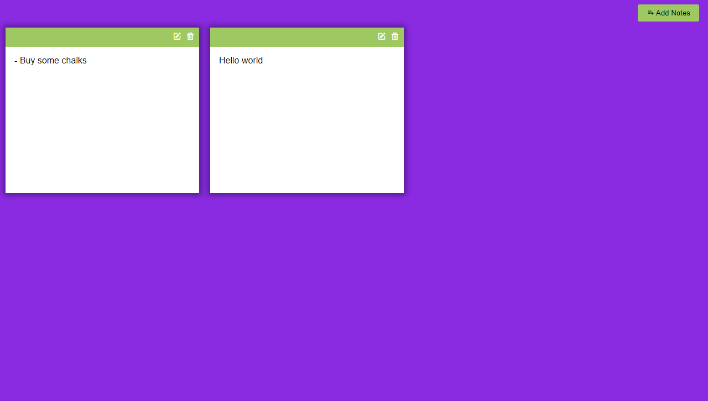

# Note-App
This app is built with HTML | CSS | Javascript a CRUD application were a user can take notes, it persist Data on the browser using local storage as an implementation.

## Built With

- HTML
- Javascript
- Css

## To get a local copy up and running follow these simple example steps.

- Clone this repo to your machine by using Git clone: Git clone `https://github.com/DuaneDave/Note-App.git`
- open in your vs code terminal and run live 
- `npm install -g @lhci/cli@0.7.x`
- `npm install --save-dev hint@6.x`
- `npm install --save-dev stylelint@13.x stylelint-scss@3.x stylelint-config-standard@21.x stylelint-csstree-validator@1.x`

### Run the following tests:

- `npx hint .`
- `npx stylelint "\*_/_.{css,scss}"`
- `npx eslint .`

### LIVE DEMO

Check the live demo here [LINK](https://duanedave.github.io/Note-App/)

## Authors 1

👤 **Obiebi Okiemute David**

- GitHub: [@githubhandle](https://github.com/DuaneDave)
- Twitter: [@twitterhandle](https://twitter.com/dave_duane)
- LinkedIn: [LinkedIn](https://www.linkedin.com/in/okiemute-david-obiebi-6b4a6a230/)

## 🤝 Contributing

Contributions, issues, and feature requests are welcome!

Feel free to check the [issues page](https://github.com/DuaneDave/Note-App/issues).

## Show your support

Give a ⭐️ if you like this project!

## Acknowledgments

- Hat tip to anyone whose code was used
- Inspiration
- etc

## 📝 License

This project is licensed by [MIT](./LICENSE).
